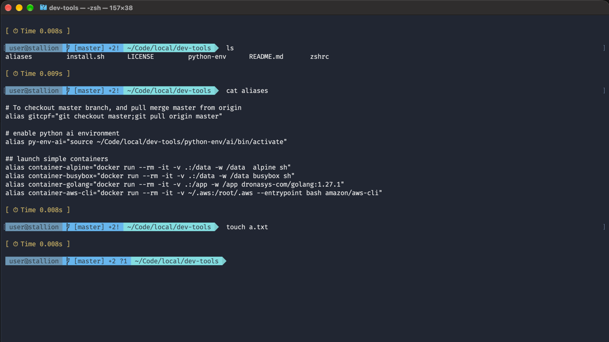

# dev-tools

Styles the terminal. No need for nerd fonts or ohmyzsh. Simple implementation.

* Shows git branch, modified file count, new file count for git folders
* Shows time taken for a command to execute
* Styles the prompt, supports any terminal
* Frequently used commands as aliases
* Autocomplete on makefile targets



## Install

Run install.sh to install brew for current user, and create a python environment
```
./install.sh
```

The above command does the following
* Clone brew into home directory (brew for local users - no admin password required)
* Create an python environment called ai

### Terminal Styling

Add the following in .zshrc file on root directory
```
## source zshrc from dev-tools repo
source ~/[PATH]/dev-tools/zshrc
source ~/[PATH]/dev-tools/aliases
```


## Why not powershell or ohmysh

In some controlled environment, we cannot install any third party plugins, this is a straight implementation using zsh vanilla function.

If you want to use Nerd fonts, please fork this project. The ZSHRC file is configurable.

## Sample commands

```
alias proxy-server="ssh -i ~/.ssh/[PEMFILE] -D [PROXY-PORT] -N [user@hostname]"
alias connect-server="ssh -i ~/.ssh/[PEMFILE] [user@hostname]"
```

## References
* [Ansii Font Control and Color Code](https://github.com/fidian/ansi)
* [Unicode Symbols](https://en.wikipedia.org/wiki/List_of_Unicode_characters#Cuneiform)

## Target Audience
Mac users. Other OS users can fork this project, and use it as a starter template.